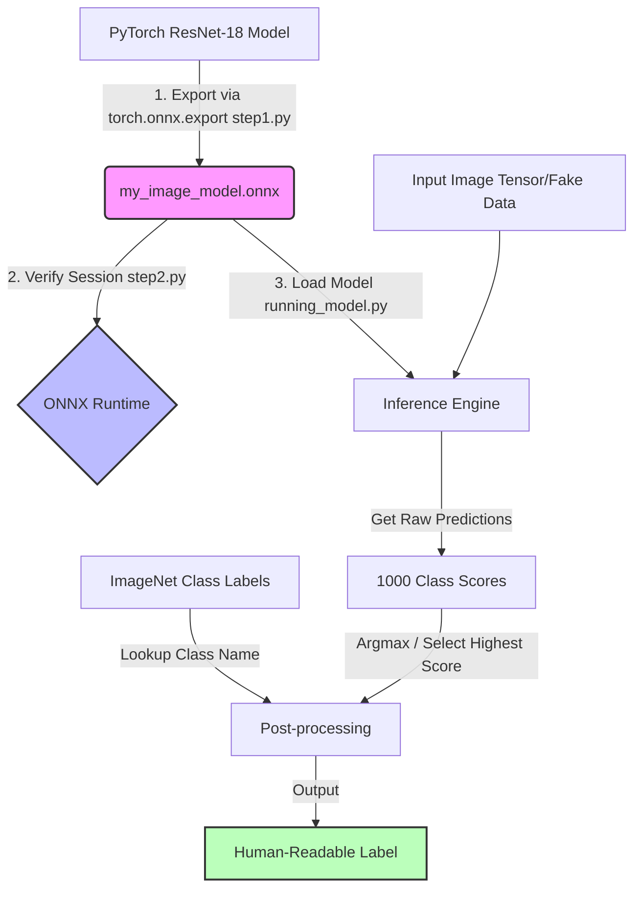

# ONNX Image Model Pipeline

This repository demonstrates how to export a pre-trained PyTorch deep learning model to the Open Neural Network Exchange (ONNX) format and execute high-performance inference using ONNX Runtime.

## 📋 Table of Contents
1. [Overview & Flowchart](#-overview--flowchart)
2. [File Significance](#-file-significance)
3. [Setup & Installation](#-setup--installation)
4. [Usage Instructions](#-usage-instructions)

---

## 🗺️ Overview & Flowchart

The system follows a three-step process: **Model Exporting**, **Verification**, and **Production Inference**.



---
flowchart - image.png

## 🗂️ File Significance

Here is a breakdown of every file in this workspace and its role:

| File | Significance |
| :--- | :--- |
| **`step1.py`** | **Model Exporter**: Loads a pre-trained `ResNet18` model from `torchvision`, creates a dummy input tensor, and exports the model structure and weights to the ONNX format. |
| **`step2.py`** | **Basic Verifier**: Loads the exported ONNX model into `onnxruntime` and performs a quick inference pass with random numpy-based inputs to verify that the export succeeded and is readable by the runtime. |
| **`running_model.py`** | **End-to-End Inference**: A production-like script that downloads the official 1,000 ImageNet text labels, processes an input image tensor, runs inference with the ONNX model, finds the highest-scoring class, and prints the human-readable result. |
| **`my_image_model.onnx`** | The exported ONNX model file containing the computational graph representation. |
| **`my_image_model.onnx.data`** | The external binary file containing model weights (parameters) that are too large to fit directly in the single `.onnx` graph definition file. |
| **`requirements.txt`** | Lists the required third-party Python packages (`torch`, `torchvision`, `onnx`, `onnxruntime`, `onnxscript`, `numpy`, `requests`, `pillow`) needed to run the scripts. |
| **`.gitignore`** | Configures Git to ignore python cache files (`__pycache__/`) and the virtual environment directories (`venv/`, `env/`) to keep the repository clean. |

---

## 🛠️ Setup & Installation

### 1. Create a Python Virtual Environment
Run the following command in your terminal:
```powershell
python -m venv venv
```

### 2. Activate the Virtual Environment
*   **PowerShell**:
    ```powershell
    venv\Scripts\Activate.ps1
    ```
*   **Command Prompt**:
    ```cmd
    venv\Scripts\activate.bat
    ```
*   **Git Bash**:
    ```bash
    source venv/Scripts/activate
    ```

### 3. Install Dependencies
```bash
pip install -r requirements.txt
```

---

## 🚀 Usage Instructions

### Step 1: Export the PyTorch model to ONNX
Run the export script. This generates the `.onnx` and `.onnx.data` files in the project root directory.
```bash
python step1.py
```

### Step 2: Verify the ONNX model is functional
Run the verifier script to ensure `onnxruntime` can successfully load and execute the model.
```bash
python step2.py
```

### Step 3: Run full inference pipeline
Run the inference script to see how to process model predictions and turn raw scores into human-readable text labels.
```bash
python running_model.py
```
